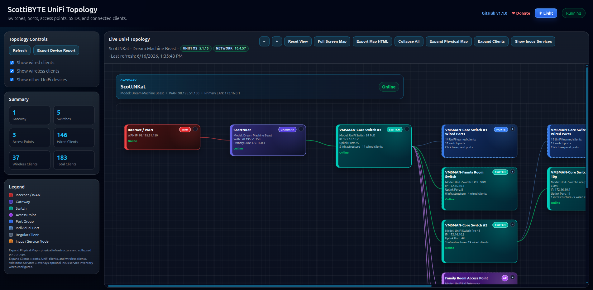

# ScottiBYTE UniFi Topology

ScottiBYTE UniFi Topology is a self-hosted web utility for visualizing a UniFi network as an interactive topology map.

It maps the WAN, gateway, switches, access points, port groups, ports, wired clients, wireless clients, SSIDs, and optional Incus service inventory.

## Screenshot

## Features

- UniFi gateway, switch, AP, port, and client topology mapping
- Physical topology view
- Client-expanded topology view
- Optional Incus service overlay using Blast Radius inventory
- Light and dark mode
- GitHub and PayPal donate links
- UniFi OS and Network version badges with release-note links
- HTML export for offline documentation
- Summary and legend panels

## Version

Current release: **v1.0.2**

## Requirements

- Node.js 22 or newer, or Docker
- UniFi Network controller or UniFi OS console access
- A local `data/config.json` file based on `config.example.json`

## Configuration

This application does not use a `.env` file.

Configuration is stored in:

    data/config.json

Create it from the included example:

    mkdir -p data
    cp config.example.json data/config.json
    nano data/config.json

The `data/` directory is intentionally ignored by Git so UniFi credentials are not committed.

## Example config.json

    {
      "port": 3051,
      "unifi": {
        "gatewayHost": "https://172.16.0.1",
        "primaryLanGateway": "172.16.0.1",
        "username": "YOUR_LOCAL_UNIFI_USERNAME",
        "password": "YOUR_LOCAL_UNIFI_PASSWORD",
        "site": "default",
        "insecureSSL": true,
        "pollSeconds": 30
      },
      "blastRadius": {
        "enabled": false,
        "baseUrl": "http://YOUR_BLAST_RADIUS_HOST:3050"
      }
    }

## UniFi Configuration

The `unifi` section is required.

- `gatewayHost`: URL of your UniFi OS console or UniFi controller.
- `primaryLanGateway`: Primary LAN gateway IP shown in the topology.
- `username`: Local UniFi username.
- `password`: Local UniFi password.
- `site`: UniFi site name. Most single-site installs use `default`.
- `insecureSSL`: Use `true` for self-signed UniFi certificates.
- `pollSeconds`: Refresh interval for polling UniFi data.

For best results, use a local UniFi account rather than a cloud-only SSO account.

## Optional Blast Radius / Incus Inventory

The `blastRadius` section is optional.

When enabled, ScottiBYTE UniFi Topology calls:

    http://YOUR_BLAST_RADIUS_HOST:3050/api/model

It extracts Incus host and instance data from Blast Radius and overlays those services onto the UniFi topology.

Example:

    "blastRadius": {
      "enabled": true,
      "baseUrl": "http://172.16.2.161:3050"
    }

If Blast Radius is disabled, unavailable, or returns no Incus inventory, the app still works normally. The **Add Incus Services** button is hidden automatically when no service inventory is available.

## Run with Node.js

Install dependencies:

    npm install

Start the app:

    node server.js

Open:

    http://localhost:3051

## Run with Docker Compose

Create your config first:

    mkdir -p data
    cp config.example.json data/config.json
    nano data/config.json

Start the container:

    docker compose up -d --build

Open:

    http://localhost:3051

The included compose file mounts:

    ./data:/app/data

Inside the container, the app reads:

    /app/data/config.json

## Docker Image

Published image:

    scottibyte/unifi-topology

Example:

    docker run -d \
      --name unifi-topology \
      -p 3051:3051 \
      -v $(pwd)/data:/app/data \
      scottibyte/unifi-topology:latest

# 🌐 Community

## Community Support

Need help with Unifi Topology, Docker deployment, Incus profile management, container creation, or ScottiBYTE utilities?

Join the ScottiBYTE Rocket.Chat community:

[Join ScottiBYTE Rocket.Chat](https://go.rocket.chat/invite?host=chat.scottibyte.com&path=invite%2FaCh2oW)

New users can start in `#general`. From there, you can find other ScottiBYTE project channels and community discussions.

For bugs and feature requests, please continue to use GitHub Issues.
For quick questions and community discussion, use Rocket.Chat.
    
## Release Notes

### v1.0.2

- Fixed UniFi OS version bubble links so they resolve to the correct hardware-family-specific release page.
- Added support for UniFi OS release families including Dream Machines, Cloud Gateways, Cloud Keys, Express, Dream Wall, Enterprise Network Video Recorders, and NAS-style UniFi OS devices.
- Added headless Chromium release lookup fallback to discover the correct UniFi Community release URL when the standard release service does not return a direct result.
- Added persistent local release URL caching with `data/releaseUrlCache.json`.
- Improved release-link click speed after the first successful lookup.
- Prevented older UniFi OS release UUIDs from being reused after a version change by including the version and hardware-family slug in the cache key.
- Failed release lookups are not cached, allowing the app to retry later if UniFi Community indexing is delayed.
- Left UniFi authentication/session behavior unchanged.

### v1.0.1

Docker and documentation release.

Fixes and improvements:

- Updated Docker image base to Node 22.
- Added Docker build dependencies for native package installation.
- Added Chromium to the runtime image for release-note link resolution.
- Added `.dockerignore`.
- Expanded `config.example.json` to include optional Blast Radius settings.
- Updated README configuration instructions for `data/config.json`.
- Clarified that the app does not use a `.env` file.

### v1.0.0

Initial stable release.

Highlights:

- Maps UniFi WAN, gateway, switches, access points, port groups, ports, wired clients, wireless clients, and SSIDs.
- Adds Expand Physical Map, Expand Clients, and Add Incus Services modes.
- Adds optional Incus service overlay.
- Adds high-contrast topology node colors.
- Adds light and dark mode support.
- Adds GitHub and PayPal donation links.
- Adds UniFi release-note links.
- Adds HTML export.
- Adds summary and legend panels.
